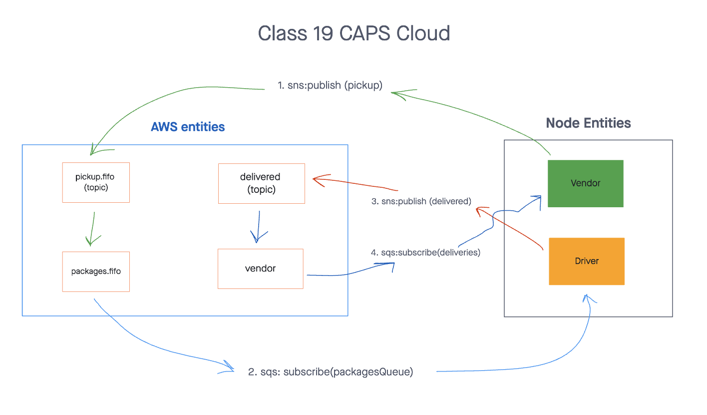

# CAPS Cloud
> This repository implements a cloud version of the Code Academy Parcel Service (CAPS) system using AWS services: Simple Queue Service (SQS) and Simple Notification Service (SNS)

## Installation

> Start with: `npm install`

## Usage

> To test, use: `npm test`
> To run vendor, use: `npm run vendor`
> To run driver, use: `npm run driver`

## UML Diagram

## PR link
[PR link](https://github.com/cleecoloma/caps-cloud/pull/1)

## Contributors
* Chester Lee Coloma